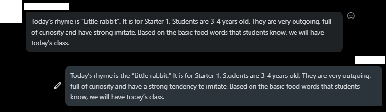

# How to Proofread 
### Introduction

Clarity and correctness are important in writing for effective communication. Proofreading is the process of looking at a written piece and locating inefficiencies or errors with it. Using a standardized process reduces the time required to proofread and improves the final product. 

### Resources Needed

*   A Written Piece
*   A Computer
*   A Pen
*   A Printer
*   Another person

### Instructions

###### _Foreword: Steps can be skipped if a resource is unavailable but for best results follow each._
###### _Tip: While editing the document markdown recurrent errors._

1. **Have a firm establishment of goals for the writing.**
    * Part of proofreading involves removing inconsistent stylistic choices. 
    * This is important to keep in mind while working through the document.
2.  **Use an automated spelling and grammar checker.**
    * Examples of programs that can be used are Microsoft Word and Grammarly.
    * Many errors can be found this way to begin the process.  
    * Be cautious as false positives can occur.
	
	
	 
	 
3. **Read the work aloud carefully.**
    * Many subtle errors and missing words can be found this way.
4. **Print the document out.**
    * Presenting the words in a different format increases the chances of finding a potential error.
    * Take a pen and mark every error found.
    * Mark sentences for deletion or editing needed.
5. **Go back to the computer and apply revisions to the writing.**
    * While applying changes consider step 1.
6. **Have another person look at the writing.**
    * Have a second individual mark or suggest revisions that may not have come to you.
    * Make sure not to devalue their time by making as many corrections as possible before presenting.
    * Getting additional readers to look over the work is generally better.
	
7. **Consider and apply changes and suggestions from the other individuals**
    * Reconsider step 1 once again while revising.
8. **Repeat these steps.**
    * Repeat until the quality desired is achieved.
